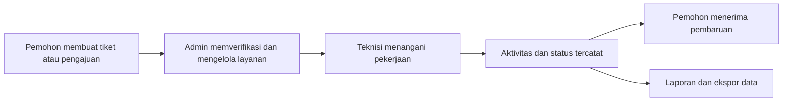

# Helpdesk System

Platform layanan helpdesk untuk mengelola permintaan bantuan, tiket perbaikan, penugasan teknisi, monitoring aktivitas, dan pelaporan layanan dalam satu sistem terintegrasi.

Sistem ini dirancang untuk mempercepat alur layanan dari pelaporan pengguna sampai penyelesaian oleh teknisi, sekaligus menyediakan histori aktivitas dan laporan yang dapat diekspor.

## Gambaran Sistem



## Fitur Utama

- Manajemen tiket perbaikan layanan.
- Pengajuan barang dengan status dan histori proses.
- Penugasan serta pencatatan kegiatan teknisi.
- Monitoring log pengajuan dan log perbaikan.
- Laporan kegiatan, perbaikan, dan permintaan barang.
- Ekspor laporan ke Excel, PDF, dan Word.
- Notifikasi database dan pembaruan realtime menggunakan Laravel Reverb.
- Profil pengguna untuk mengubah data pribadi dan password.
- Reset password melalui email.
- Manajemen pengguna dan role berbasis permission.
- Filter data berdasarkan status, tanggal, kategori, dan kebutuhan operasional.

## Role Pengguna

| Role | Panel | Akses utama |
| --- | --- | --- |
| `pemohon` | `/pemohon` | Membuat dan memantau tiket perbaikan serta pengajuan barang miliknya sendiri. |
| `teknisi` | `/admin` | Melihat dan menangani tiket, memperbarui proses, serta mencatat kegiatan teknisi. |
| `admin` | `/admin` | Mengelola layanan, pengguna, ruangan, monitoring, dan laporan operasional. |
| `super_admin` | `/admin` | Akses administratif penuh, termasuk pengelolaan role dan permission. |

## Teknologi

- PHP 8.3
- Laravel 13
- Filament 5
- Livewire 4
- MySQL
- Laravel Reverb dan Laravel Echo untuk realtime event
- Spatie Laravel Permission untuk role dan permission
- Laravel Excel untuk ekspor spreadsheet
- DomPDF dan PHPWord untuk dokumen laporan
- Vite dan Tailwind CSS 4 untuk asset frontend

## Persyaratan

- PHP 8.3 atau lebih baru
- Composer
- Node.js dan npm
- MySQL/MariaDB
- Ekstensi PHP yang dibutuhkan Laravel dan koneksi database

## Instalasi Lokal

Clone repository lalu masuk ke folder proyek:

```bash
git clone <url-repository> helpdesk
cd helpdesk
```

Install dependency dan siapkan environment:

```bash
composer install
cp .env.example .env
php artisan key:generate
```

Atur koneksi database pada `.env`, kemudian jalankan migrasi:

```bash
php artisan migrate
```

Install dan build asset frontend:

```bash
npm install
npm run build
```

## Konfigurasi Environment

Contoh konfigurasi database:

```dotenv
DB_CONNECTION=mysql
DB_HOST=127.0.0.1
DB_PORT=3306
DB_DATABASE=helpdesk_dev
DB_USERNAME=root
DB_PASSWORD=
```

Untuk pengembangan tanpa email sungguhan, gunakan mailer log:

```dotenv
MAIL_MAILER=log
```

Link reset password dapat dibaca pada `storage/logs/laravel.log`. Untuk mengirim email sungguhan, ganti `MAIL_MAILER` dengan konfigurasi SMTP yang valid.

## Menjalankan Aplikasi

Mode development utama:

```bash
composer run dev
```

Perintah tersebut menjalankan server Laravel, queue listener, dan Vite secara bersamaan. Jika membutuhkan realtime notification, jalankan Reverb pada terminal terpisah:

```bash
php artisan reverb:start
```

Alternatif menjalankan server web dan Vite secara terpisah:

```bash
php artisan serve
npm run dev
```

Panel aplikasi tersedia pada:

- Admin: `http://localhost:8000/admin`
- Pemohon: `http://localhost:8000/pemohon`

Sesuaikan URL dengan nilai `APP_URL` dan konfigurasi web server lokal yang digunakan.

## Struktur Folder Utama

```text
app/
|-- Broadcasting/       # Channel realtime
|-- Events/             # Event aktivitas helpdesk
|-- Exports/            # Export laporan
|-- Filament/           # Panel, resource, page, widget, dan exporter
|-- Http/               # Controller dan middleware
|-- Models/             # Model user dan domain helpdesk
|-- Notifications/      # Notifikasi aplikasi
`-- Services/           # Layanan notifikasi dan generator laporan

database/
|-- factories/          # Factory untuk pengujian dan data awal
|-- migrations/         # Struktur database
`-- seeders/            # Data awal aplikasi

resources/
|-- css/                # Style frontend
|-- js/                 # Echo dan integrasi JavaScript
`-- views/              # Blade views
```

## Keamanan

- Akses panel dibatasi berdasarkan role pengguna.
- Data pemohon dibatasi pada tiket dan pengajuan miliknya sendiri.
- Password disimpan menggunakan hashing Laravel.
- Reset password menggunakan token dengan masa berlaku terbatas.
- Permission resource dikelola dengan Filament Shield dan Spatie Permission.
- Jangan memasukkan kredensial SMTP, `APP_KEY`, atau secret Reverb ke repository.

## Pengujian

Jalankan seluruh test suite dengan:

```bash
php artisan test --compact
```

## Lisensi

Proyek ini dikembangkan untuk kebutuhan operasional helpdesk. Lisensi dan aturan distribusi mengikuti kebijakan organisasi pemilik repository.
